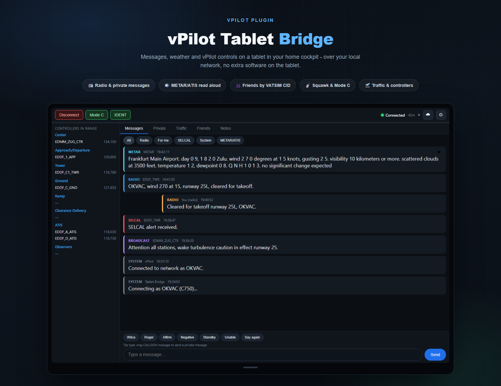

# vPilot Tablet Bridge



vPilot plugin that mirrors radio, private, broadcast and SELCAL messages
(plus connect/disconnect notices) to a small web page served over your home
network, so you can read them on a tablet in a cockpit where the PC itself
is out of reach.

## How it works

The tablet page mirrors vPilot's own window layout (toolbar, Controllers In
Range on the left, tabbed content on the right) rather than being just a
message log. Full feature-by-feature detail is in "User guide" below; at
the architecture level:

- The plugin implements vPilot's `IPlugin` interface and subscribes to the
  relevant `IBroker` events: messages (`RadioMessageReceived`,
  `PrivateMessageReceived`, `BroadcastMessageReceived`, `SelcalAlertReceived`,
  `MetarReceived`, `AtisReceived`), connection state (`NetworkConnected`,
  `NetworkDisconnected`), ATC in range (`ControllerAdded`, `ControllerDeleted`,
  `ControllerFrequencyChanged`), and nearby traffic (`AircraftAdded`,
  `AircraftUpdated`, `AircraftDeleted`).
- Every message is appended to an in-memory log (last 300 entries).
- A small HTTP server, built directly on `TcpListener` (not
  `System.Net.HttpListener`, which needs admin rights or a `netsh` URL
  reservation to bind anything but `localhost`), serves the page and a JSON
  API: `GET /api/messages`, `/api/status`, `/api/controllers`, `/api/traffic`,
  and `POST /api/connect`, `/api/disconnect`, `/api/send`, `/api/metar`,
  `/api/atis`, `/api/settings` for the actions the tablet can trigger.
- The page beeps on a new message, with a distinct, more insistent tone
  specifically for SELCAL alerts; sounds can be turned off entirely from
  the settings (⚙) panel.
- The page requests a screen wake lock so the tablet doesn't dim/lock
  itself while it's open - see the caveat about this below.

Two things vPilot's plugin API has no getter for at all, so they simply
aren't in this UI: current COM1/COM2 frequency and TX/RX state, and flight
plan filing (no `RequestFlightPlan`/`FileFlightPlan` method exists in the
installed vPilot version's plugin API). A transponder (Mode C) toggle was
tried too, but was dropped - the API has a setter but no getter for it, so
the tablet could only ever show "the last state we set from here," not the
real state, which wasn't worth the confusion.

Everything is self-contained: no internet access, no external libraries,
just the plugin DLL sitting in vPilot's `Plugins` folder.

## Installation

1. Get `VpilotTabletBridge.dll` - either download the pre-built one from
   the [Releases](../../releases) page, or build it yourself (see "Setting
   up a fresh clone" and "Rebuilding" below).
2. Copy `VpilotTabletBridge.dll` into vPilot's `Plugins`
   folder:
   ```powershell
   copy "bin\Release\VpilotTabletBridge.dll" "$env:LocalAppData\vPilot\Plugins\"
   ```
   (vPilot must be closed while you do this - it locks the file while running.)
3. Start vPilot. The very first time this plugin ever runs, it opens a QR
   code for the tablet's address in your PC's default browser
   automatically - scan it with the tablet's camera to jump straight to
   the page. It only does this once ever (a marker file next to the DLL
   remembers it happened, the same way a Windows tray notification was
   tried here at one point and dropped - unwanted background popups
   aren't worth it for a repeat notification). To see that QR code again
   later, open `http://<the PC's address>:8686/qr` in any browser on the
   PC.

   If you'd rather type the address by hand, or the QR page didn't open:
   type `.debug` into vPilot (in the main text box, like any other dot
   command) to open the separate "vPilot Debug Messages" window. That
   window only shows messages posted *after* it's opened, so the plugin
   posts the address(es) twice - immediately on startup, and again ~10s
   later - to give this a real chance of landing even if you type
   `.debug` a few seconds after vPilot starts rather than before. The same
   addresses are always written to
   `%LocalAppData%\vPilot\Plugins\TabletBridge-debug.log` next to the DLL
   too, if you'd rather check there instead. (There is no way for a
   plugin to write into vPilot's normal Messages panel directly - only
   into that separate debug window, the QR page, or by actually
   transmitting a real radio/private message over the network, which
   would obviously be inappropriate for a local startup notice.)

   If none of that shows anything at all, see "Troubleshooting" below.
4. On the tablet - **while it's on the same Wi-Fi network as the PC** -
   open that address in a browser (or just scan the QR code from step 3).
   Add it to the home screen for a quick full-screen shortcut. **On iPad,
   use Safari** - see the known Chrome issue further down if you'd rather
   use Chrome there.

## User guide

What each part of the tablet page actually does, once it's up and running
on `http://<your-pc-lan-ip>:8686/`.

### Connecting

Tap **Connect** in the top-left. A form drops down for callsign, aircraft
type and an optional SELCAL code. The aircraft type field suggests ICAO
type designators as you type (e.g. `A320`, `B738`) - vPilot needs the ICAO
type, not an IATA airline code. Both fields remember what you used last
time and pre-fill automatically; the aircraft type box also puts your last
one at the top of its suggestion list. Whether the callsign specifically
gets remembered can be turned off in Settings (see below) - useful if
different people fly from the same tablet/cockpit.

Once connected, the same button becomes **Disconnect** (asks for
confirmation first), the pill next to it turns green and shows your
callsign plus how long you've been connected, updated every 30 seconds.

### Reading messages

The **Messages** tab lists radio traffic, broadcasts, SELCAL alerts,
METAR/ATIS results, and your own connect/disconnect notices - color-coded
by type. Private messages don't appear here - see "Private conversations"
below. The filter chips above the list (All / Radio / **For me** - radio
calls that actually name your callsign, nothing else; SELCAL already has
its own filter / SELCAL / System / METAR/ATIS) narrow it down further.
New arrivals switch things automatically so
you don't have to go looking for them: SELCAL takes you to Messages with
the SELCAL filter, a private message jumps straight to its own
conversation in the Private tab, a radio call that mentions your own
callsign switches to the Radio filter, and a METAR/ATIS result switches to
that filter - in that priority order if several land at once. A new
arrival also plays a short beep (a more insistent double-tone specifically
for SELCAL), unless sounds are turned off in Settings.

The bar at the bottom sends on the **current radio frequency**. Three
quick-reply buttons (Wilco / Roger / Standby) send that word immediately.

### Private conversations

Private messages get their own **Private** tab, one conversation per
callsign - the same idea as any VATSIM client, and deliberately not just
one giant shared list, so it doesn't turn into a mess once you're juggling
several chats at once. A strip of conversation chips across the top lets
you switch between them (scrolls sideways if there are more than fit; a
chip gets a small dot when it has a message you haven't seen yet), each
with its own thread and its own reply box underneath.

Three ways to start or jump to a conversation:
- Type `.msg CALLSIGN your message` (or `.chat CALLSIGN ...`) into the
  **Messages** tab's own reply box - matches the `.msg`/`.chat` command
  real VATSIM clients use. Leave the message part off (just
  `.msg CALLSIGN`) to open that conversation without sending anything yet.
- Tap **PM** on a row in the **Traffic** tab.
- Type a callsign into the "Nový chat" box at the top of the Private tab
  itself and tap **Otevřít**.

Any of these switches you straight to that conversation, ready to type.

### Weather - METAR and ATIS

The ☁ button in the toolbar opens a small form. Both fields just need an
airport's ICAO code (e.g. `LKPR`) - for ATIS, `_ATIS` is appended
automatically, and if the airport splits it into separate Arrival and
Departure ATIS, both are requested at once; whichever is actually staffed
answers, the other is silently ignored. Results land in the message log
under the "METAR/ATIS" filter. Both fields also accept a specific
callsign typed in full (e.g. `LKPR_A_ATIS`), and clear themselves once a
request is confirmed sent successfully.

If a VATSIM CID is set in Settings, this panel also shows one-tap buttons
for your currently filed flight plan's departure and destination airports
(pulled from VATSIM's public data feed - vPilot's own plugin API doesn't
expose flight plan data at all) - tapping one requests ATIS if that
airport currently has one staffed (checked against the Controllers In
Range list), or METAR otherwise. The departure button only counts a
combined ATIS or a split departure (`_D_ATIS`) one, and the arrival
button only a combined or split arrival (`_A_ATIS`) one - each ignores
the other direction's split ATIS if that's the only one online. Entirely
optional: leave the CID field blank and this whole area stays hidden. If
a CID is set but nothing shows up, open the panel and check for a message
there - either no flight plan was found on VATSIM for that CID, or the
tablet itself couldn't reach VATSIM's data feed. Unlike everything else in
this plugin, this one feature needs the tablet itself (not just the PC
running vPilot) to have general internet access, since it talks to
VATSIM's feed directly rather than through the plugin's own local server.

Every METAR/ATIS entry has a ▶ button that reads it aloud - in aviation
phraseology, not a raw letter-by-letter spelling of the METAR code, e.g.
"wind two seven zero degrees at 15 knots, gusting 25" and "scattered
clouds at 3500 feet" rather than reading "27015G25KT SCT035" as-is.
Standalone letters (an ATIS information identifier, a spelled-out
designator) are read using the phonetic alphabet ("information Delta"),
while glued groups like `QNH1013`, `T12` and `DM05` are split out and their
digits read individually. Both also lead with the airport's full name where
it can be resolved (e.g. "Frankfurt Main Airport" for `EDDF`), looked up
from a bundled offline table covering essentially every ICAO-coded airport
worldwide - no internet access needed. The button turns into a ⏹ while
speaking - tap it again to stop the playback. It's a best-effort converter,
not a certified parser, so unusual formats may come out a bit literal. This is deliberately
*not* offered for radio/private messages - those already have real voice
traffic going on via Audio for VATSIM, and having the tablet talk over that
too would just be noise.

### Traffic

The **Traffic** tab lists nearby aircraft as vPilot currently sees them -
callsign, type, altitude, heading, speed. There's a **PM** button on each
row that jumps straight to that callsign's conversation in the Private
tab. Note: this list isn't sorted by actual distance from
you - vPilot's plugin API doesn't expose your own aircraft's position, so
there's no way to compute a real distance or bearing here. It's simply
whatever vPilot itself is currently modeling as traffic, which vPilot
already limits to nearby aircraft before these ever reach a plugin.

### Friends

The **Friends** tab lets you track specific people by VATSIM CID rather
than whoever happens to be nearby - add a CID (and an optional name) and,
whenever they're online, their current callsign shows up automatically
with a **PM** button to jump straight into a conversation with them. If
they're flying, their route (departure → arrival, from their filed
flight plan) shows too; if they're controlling, it shows their frequency
instead - either way counts as online. Someone not currently connected
either way shows as "Offline" - there's no way to message them without a
live callsign to send to. Sourced from the same VATSIM data
feed as the flight-plan buttons in Weather, refreshed on the same
2-minute schedule (one fetch serves both), and needs the same tablet-side
internet access. Friends are stored locally on that tablet, like every
other per-device setting here.

A friend going from offline to online gets a quiet toast notification -
deliberately just that, no sound, so it doesn't compete with an incoming
message or a SELCAL alert. It only fires on the actual transition, not
on every 2-minute refresh they happen to still be online for, and never
retroactively for someone already online when you add them or first open
the tablet.

### Transponder

**Mode C** and **IDENT** sit right in the toolbar next to Connect, like in
vPilot's own app. Mode C turns green while "on" - but that only ever means
what this tablet last told it, never a confirmed state, since vPilot's
plugin API doesn't report the transponder's actual state back to plugins.
It resets to "off" on every page load rather than persisting a guess
across sessions. IDENT lights up green for 18 seconds after a tap,
matching how long it stays lit in vPilot itself; tapping it again resets
that 18 seconds instead of cutting it short.

### Notes

A plain scratchpad on the **Notes** tab, saved locally in that tablet's
browser only - it doesn't sync anywhere, including back to the PC.

### Settings

The ⚙ button opens:
- **Remember callsign between connections** - on by default.
- **Sounds for new messages** - on by default; a per-device preference,
  doesn't affect other tablets/browsers pointed at the same plugin.
- **Read airport name for METAR/ATIS** - on by default, also per-device;
  turns off the airport-name lookup described above if you'd rather hear
  the bare ICAO code.
- **VATSIM CID** - optional, per-device; enables the flight-plan quick
  buttons in the Weather panel described above. Leave it blank to skip
  this entirely.
- **Language** - CS/EN, switches the whole interface instantly. The
  Controllers In Range panel and its 8 categories stay in English
  regardless, matching standard ATC phraseology and vPilot's own window.

### Controllers In Range

The left-hand panel (collapsible on narrow/portrait screens via the button
below it) mirrors vPilot's own "Controllers In Range" list: Center,
Approach/Departure, Tower, Ground, Ramp, Clearance Delivery, ATIS,
Observers, each showing who's online and their frequency.

## Troubleshooting - plugin doesn't seem to load

If vPilot's Messages panel never shows any `[Tablet Bridge]` lines and the
tablet page won't load, check `%LocalAppData%\vPilot\Plugins\TabletBridge-debug.log`
(created next to the DLL as soon as `Initialize()` runs). No file at all
after vPilot has fully started means vPilot never called into the plugin.

That's exactly what happened during initial setup here, and the cause
wasn't this plugin: a stray copy of **`RossCarlson.Vatsim.Vpilot.Plugins.dll`
(and its `.xml`) had been left sitting directly in the `Plugins` folder** -
a known side effect of the FSLabs vPilot-integration installer. vPilot
already loads its own copy of that assembly from its main install folder;
having a second copy of the exact same assembly inside `Plugins` caused an
intermittent .NET assembly-identity collision that silently broke plugin
loading for *every* plugin (not just this one - a Telegram-notification
plugin on this same machine was equally affected and equally intermittent).

Fix: make sure `Plugins` contains only actual plugin DLLs - `.dll` files
that implement `IPlugin` - never a copy of `RossCarlson.Vatsim.Vpilot.Plugins.dll`
or `.xml` itself. If you ever reinstall or update an add-on that touches
vPilot (FSLabs' integration in particular), check the `Plugins` folder
afterwards and delete those two files again if they reappear.

## Known issue - flickering in Chrome on iPad

On iPad, the message list and other polled parts of the page flicker
continuously in **Chrome**. **Safari on the same iPad does not have this
problem** - use Safari there instead. Not investigated further since most
iPad users are on Safari anyway, but the working theory, for whoever picks
this up later: Chrome for iOS auto-hides/shows its own address bar on the
slightest scroll, which changes `window.visualViewport`'s reported height;
the page used to react to that (to keep form fields clear of the on-screen
keyboard), and that reaction itself was apparently enough to retrigger the
address bar's own show/hide - a feedback loop, Chrome-only because its
address-bar-hiding behavior differs from Safari's even though both run on
WebKit. The `visualViewport` "resize" listener was removed to fix it
(keyboard avoidance now happens only on a field's `focusin`/`focusout`, see
`www/index.html`), which didn't fully resolve it on Chrome - so there's
still something else there worth a closer look if it ever becomes a priority
(e.g. capturing a Safari remote-debugging session over USB from a Mac while
reproducing it in Chrome would be the next real step, rather than guessing
further blind).

## Known limitation - keeping the screen on

The page tries to use the Screen Wake Lock API to stop the tablet from
dimming/locking itself while mounted in the cockpit. That API only works in
a "secure context" per the browser spec - `https://` or `http://localhost` -
and this page is plain `http://<lan-ip>:8686/`, which does **not** qualify.
In practice this means the wake lock will likely just silently do nothing on
most tablets/browsers as set up here. The code is left in (it's harmless,
and works if this is ever put behind HTTPS), but don't rely on it: the
actually-reliable fix today is to just turn off the tablet's own auto-lock
in its system settings for as long as it's mounted (e.g. on iPad: Settings
→ Display & Brightness → Auto-Lock → Never).

## First run - Windows Firewall

The first time the plugin opens the port, Windows may show a "Windows
Defender Firewall has blocked some features of vPilot.exe" prompt. Allow it
on your **Private** network profile - otherwise the tablet won't be able to
reach the page even though vPilot itself works fine. If you don't see a
prompt but the tablet still can't connect, add a rule manually:

```powershell
New-NetFirewallRule -DisplayName "vPilot Tablet Bridge" -Direction Inbound -Protocol TCP -LocalPort 8686 -Action Allow -Profile Private
```

## Changing the port

Default port is `8686`. To use a different one, create
`%LocalAppData%\vPilot\Plugins\TabletBridge.ini` with:

```ini
Port=8686
```

and restart vPilot.

## Project layout

```
VpilotTabletBridge/
  VpilotTabletBridge.csproj   - .NET Framework 4.8 class library (SDK-style project)
  Plugin.cs                   - IPlugin implementation, event wiring, IP/port discovery
  MessageStore.cs             - thread-safe capped message log + JSON serialization
  PluginState.cs              - connection state + persisted last-used connect details
  Controllers.cs               - "Controllers In Range" snapshot, categorized like vPilot's own list
  Traffic.cs                    - nearby-aircraft snapshot for the Traffic tab
  Actions.cs                   - tablet-triggered actions (connect/disconnect/send) against the broker
  Json.cs                      - tiny shared JSON escaping/formatting helpers
  WebServer.cs                 - TcpListener-based HTTP server, serves the page + JSON API
  www/index.html                - the tablet page (HTML/CSS/JS, embedded as a resource)
  www/qr.html                    - the /qr connect page, with a vendored QR-code JS library
lib/
  RossCarlson.Vatsim.Vpilot.Plugins.dll  - copy of vPilot's plugin API, for compiling only (not
                                            in this repo - see "Setting up a fresh clone" below)
```

## Setting up a fresh clone

`lib/RossCarlson.Vatsim.Vpilot.Plugins.dll` isn't committed here - it's Ross Carlson's own assembly,
not something this project owns, so it doesn't belong in a public repo. Before building, copy it
in yourself from any machine with vPilot installed:

```powershell
mkdir lib -Force
copy "$env:LocalAppData\vPilot\RossCarlson.Vatsim.Vpilot.Plugins.dll" lib\
```

## Rebuilding

```powershell
cd "VpilotTabletBridge"
dotnet build -c Release
copy "bin\Release\VpilotTabletBridge.dll" "$env:LocalAppData\vPilot\Plugins\"
```

(vPilot must be closed while you overwrite the DLL, since it locks the file
while running.)

## Notes / possible follow-ups

- The log and controllers-in-range list are in-memory only; they reset
  whenever vPilot restarts.
- No authentication - anyone on your LAN who knows the address can read
  messages, connect/disconnect the session, and send messages as you.
  Fine for a home network; don't expose the port beyond your router.
- The connect form remembers the last callsign/aircraft type/SELCAL you
  used, saved to `TabletBridge-connect.ini` next to the DLL.

## License

MIT - see [LICENSE](LICENSE). Does not cover
`RossCarlson.Vatsim.Vpilot.Plugins.dll`, which isn't part of this project
and isn't included in the repo (see "Setting up a fresh clone" above).
`www/qr.html` also vendors [qrcode-generator](https://github.com/kazuhikoarase/qrcode-generator)
by Kazuhiko Arase, also MIT-licensed - copyright notice kept intact in that file.
